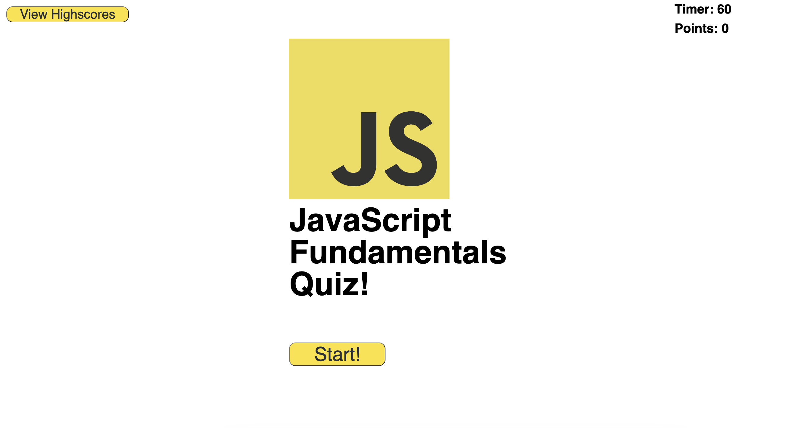
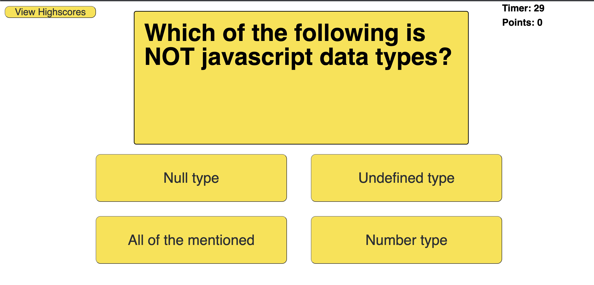
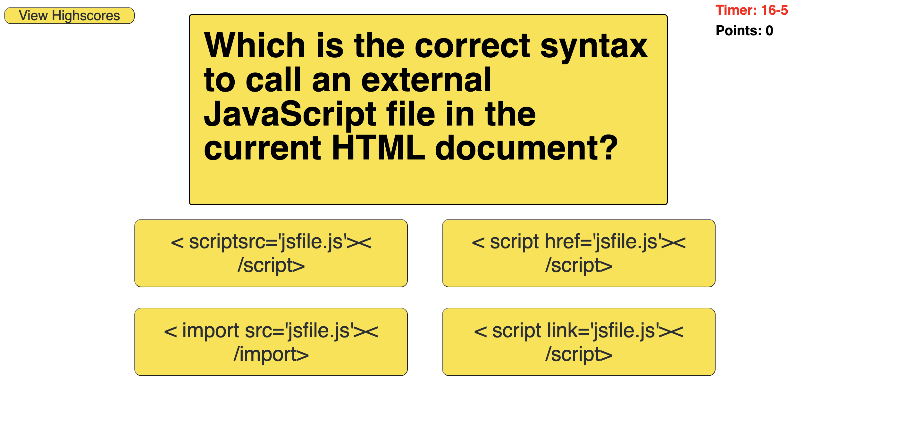
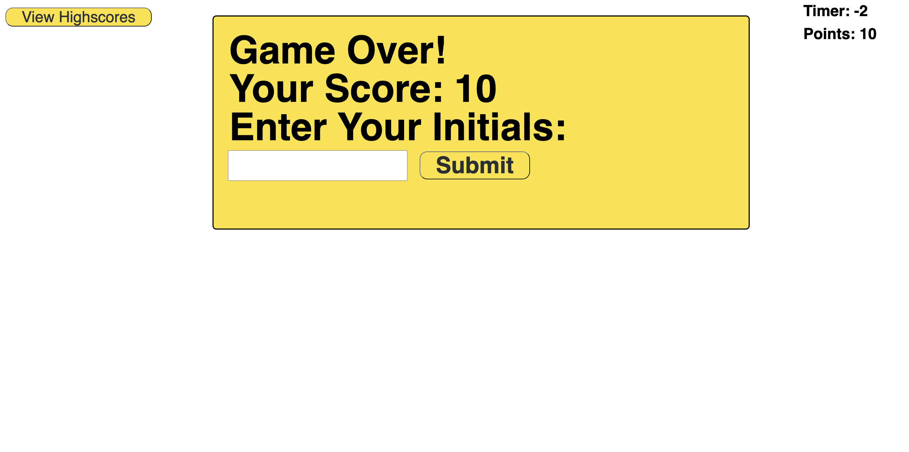
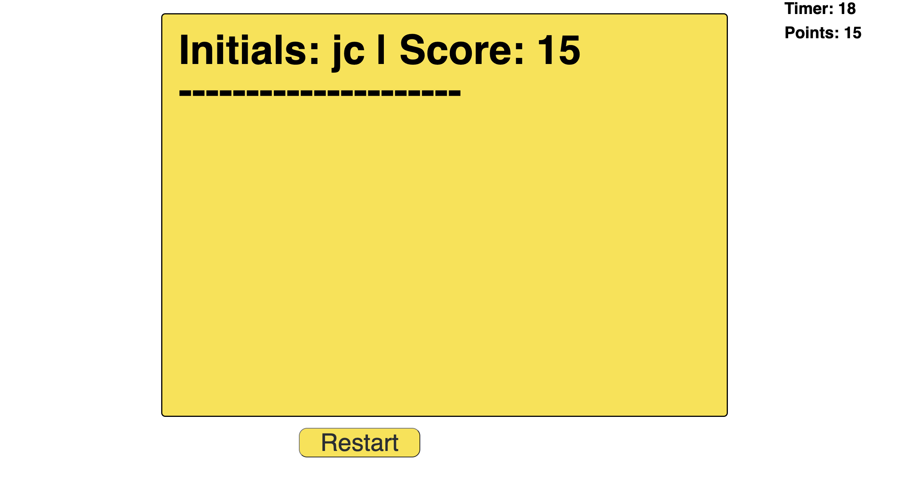

# code-quiz
## A Timed Multiple Choice Quiz On JavaScript Fundamentals:
--

The goal of this project was to build a mulitple choice quiz on some fundamental JavaScript concepts. This quiz was meant to be a fun way to brush up on some key ideas behind how JavaScript is structured, and while building this application, some key criteria needed to be met which included:

    1. The quiz and a timer will start when the "START" button has been "clicked" by the user
    2. When a question is answered incorrectly, the time will be deducted from the timer
    3. When a question is answered, either correct or incorrect, the next question will be shown
    4. The game will end either when the timer reaches zero, or all questions are answered
    5. After the game ends, there will be an option to save the user's score and initials, which will be stored locally
    6. When viewing the highscores, the scores data will be pulled from local storage and then displayed
## Installation
---

N/A

--
## Usage
---
Link to page: https://corradoj02.github.io/code-quiz/

When opening the page, users will be prompted with the starting page's display of a JavaScript logo, quiz title, an option to view the current highscores, and a start button:

 

After "clicking" the start button, the quiz will start:

If an incorrect answer is selected, time will be deducted from the timer:

When the timer reaches zero (or less if a wrong answer brings it further) or all the questions have been answered, the quiz will end showing the user's score and prompting them to enter and submit their initials:

After the user submits their initials and score, OR if they "click" on the "View Highscores" button at anytime, they are brought to the highscores and shown the currently stored highscores:

At the highscores section, the user is able to select the "Restart" button to take the quiz over again.

## Credits
---

N/A

## License
---

N/A

